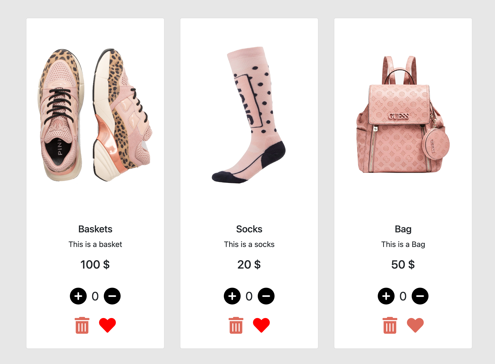

This file contains a detailed, visually engaging, and professional `README.md` for my **Shopping Cart DOM Project 1**, complete with:

* 🎯 Project Description
* 📸 Screenshots placeholders
* 🛠 Features
* 🚀 Setup Instructions
* 🙌 Credits
* ✍️ Author
* 🔗 Contact Info (Email, WhatsApp, Telegram links)

---

### ✅ Final `README.md`

```markdown
# 🛒 Shopping Cart - DOM Manipulation Project

  
A visually interactive shopping cart built using **HTML**, **CSS**, **Bootstrap**, and **Vanilla JavaScript**.  
It allows users to manage products, adjust quantities, like items, and dynamically see the updated total.

---

## 📸 Preview

  
*Adjust product quantities, delete items, and like your favorites!*

---

## 🧩 Key Features

✅ **DOM Manipulation:**  
Real-time UI updates without page reloads using `querySelector`, event listeners, and dynamic classes.

✅ **Responsive Design:**  
Styled using **Bootstrap 5** and custom CSS — optimized for desktop and mobile.

✅ **Functional Buttons:**
- ➕ Increase quantity
- ➖ Decrease quantity
- 🗑️ Delete item
- ❤️ Like/unlike item with color toggle
- 💰 Auto-update total price

✅ **FontAwesome Icons:**  
Clean, intuitive icons for actions like add/remove, delete, and like.

---

## 🛠 Technologies Used

| Technology       | Purpose                           |
|------------------|-----------------------------------|
| HTML5            | Page Structure                    |
| CSS3             | Custom Styling                    |
| Bootstrap 5      | Responsive Layout                 |
| JavaScript (ES6) | DOM Logic & Interactivity         |
| FontAwesome      | Icons for UI actions              |

---

## 🧪 How to Run This Project

### 🔃 Option 1: Open Directly

1. Clone or download this repository
2. Open `index.html` in a browser
3. Ensure your folder structure looks like this:

```

project/
│
├── index.html
├── style/
│   └── style.css
├── js/
│   └── script.js
├── assets/
│   ├── baskets.png
│   ├── socks.png
│   └── bag.png

```

> ⚠️ If images or styles don’t appear, check your file paths!

---

### 🧠 Learning Objectives

- Understanding **DOM traversal** and **event binding**
- Practicing **JS function scopes and handlers**
- Managing dynamic **state changes in the UI**
- Improving front-end design using **Bootstrap**

---

## 🙌 Credits

### 👨‍🏫 **GoMyCode School of Technology**  
For providing hands-on, project-based training on JavaScript and Web Development.

### 🏛 **Woolf College**  
For facilitating the **MSc in Software Engineering** program with a rigorous, real-world aligned curriculum.

---

## 👩‍💻 Author

### Engr. Amarachi Crystal Omereife  
🔹 MSc Software Engineering Candidate  
🔹 Devops/MLOPS Engr
🔹 Frontend + JavaScript student 

---

## 📬 Contact Me

| Platform | Link |
|---------|------|
| 📧 Email | [amarachiomereife@gmail.com](mailto:amarachiomereife@gmail.com) |
| 💬 WhatsApp | [Chat with me](https://wa.me/2348068590823) |
| 📡 Telegram | [@marameref](https://t.me/marameref) |

---

## 🌟 Show Your Support

If you liked this project, feel free to:

- ⭐ Star this repo
- 📌 Share with peers
- 💡 Fork and improve it!

---

> “Code is like humor. When you have to explain it, it’s bad.” – *Cory House*
```

---

